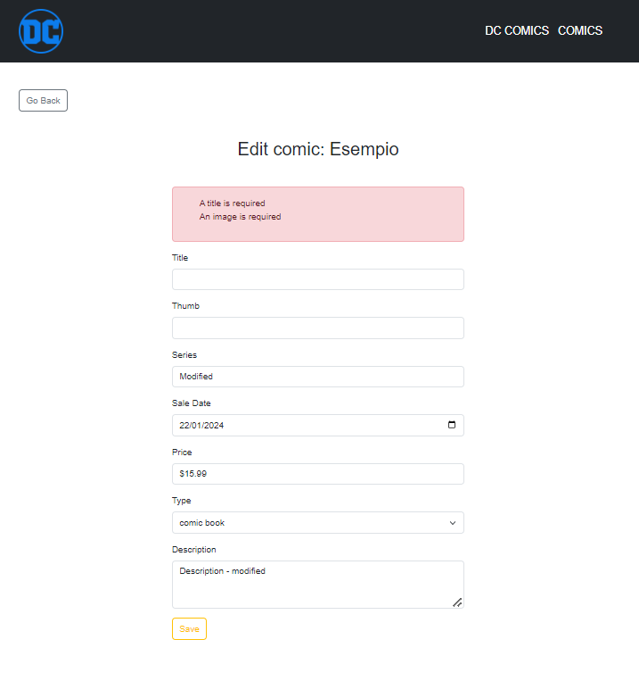

# CONSEGNA

Definire le operazioni CRUD e aggiungere le validazioni.

**Bonus:**
- [] tramite javascript, quando l'utente clicca sul pulsante "delete", chiedere conferma della cancellazione, prima di eliminare l'elemento.
Bonus:
- [x] validare gli input ricevuti in fase di creazione e modifica, rispondendo con errori chiari e in italiano.
- [x] utilizzare le Request personalizzate per validare i dati (*)

## Preview

