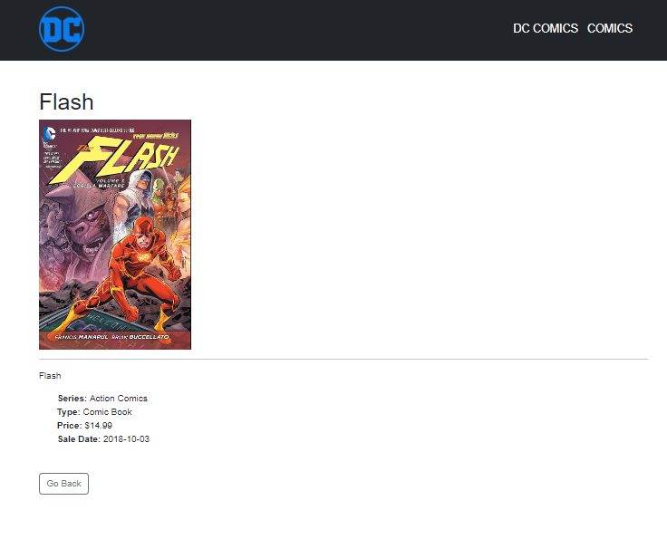

# CONSEGNA

Definire le operazioni CRUD.

**Bonus:**
tramite javascript, quando l'utente clicca sul pulsante "delete", chiedere conferma della cancellazione, prima di eliminare l'elemento.

## Preview

