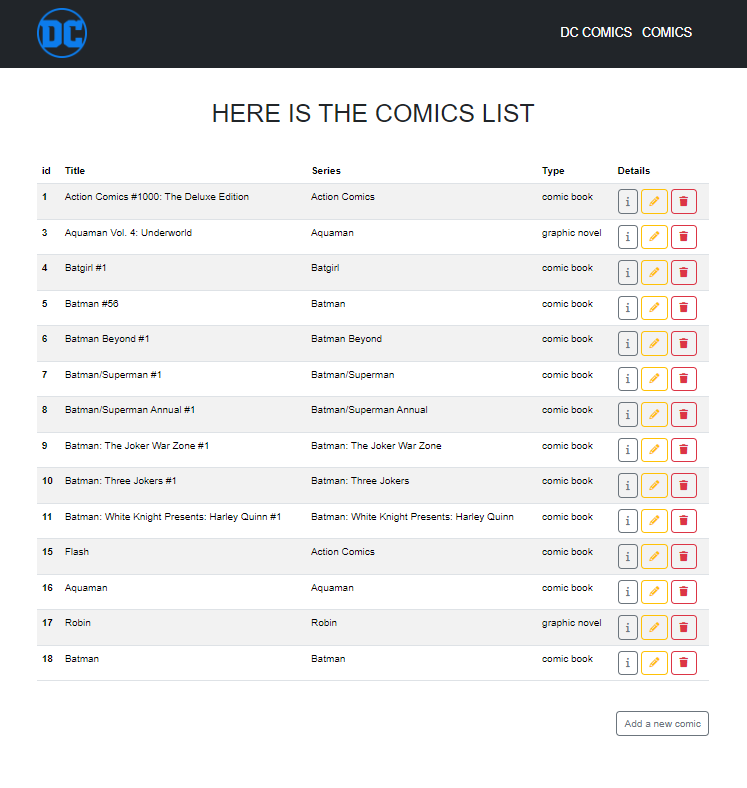
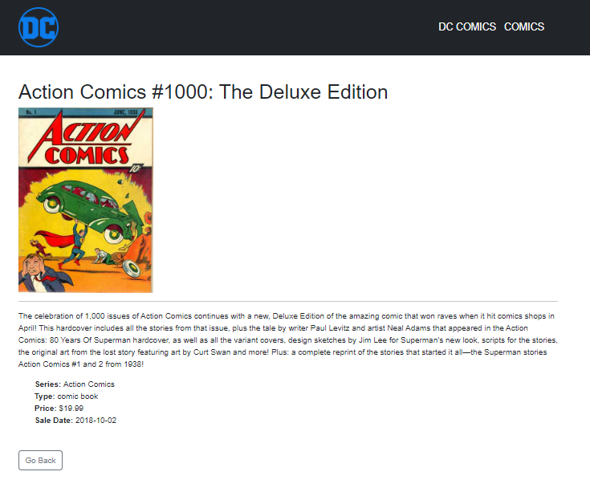

# CONSEGNA

- [x] **Milestone 1**
Tramite gli appositi comandi artisan creare un model con relativa migration e un resource controller.
- [x] **Milestone 2**
Iniziare a definire le prime operazioni CRUD con le relative view:
- [x] index()
- [x] show()
- [x] create()
- [x] store()

- [x] **Bonus:** creare il seeder per la tabella comics utilizzando il file in allegato.

## Preview

